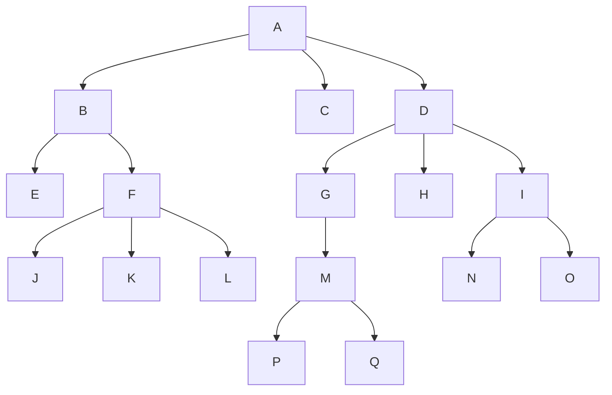
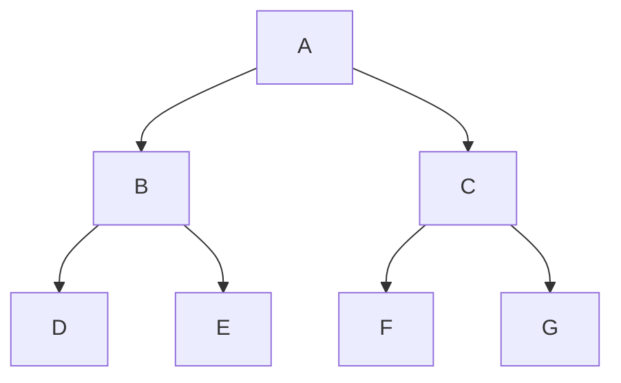

# ÀRBOLES
Un Àrbol es una colecciòn de nodos recursiva.
Cuando tiene 0 nodos, està vacìo.
Un nodo es una **raìz**, la cual tiene 0 o + referencias a otros àrboles (se llaman **subàrboles**).
Las raìces de estos subàrboles son los **hijos** de la raìz.
La raiz es **padre** de las raìces de sus subàrboles.

Los nodos sin hijos son **hojas** y los que tienen padre comùn: **hermanos**.

Ejemplo:



* *A es la raìz del àrbol y padre de B,C y D.*
* *E y F son hermanos (por ser hijos de B).* 
* *E,J,K,L,C,P,Q,H,N y O son las hojas del àrbol*

### Camino
Un camino entre un nodo \(n_1\) y \(n_k\) es la secuencia de nodos \(n_1,\ldots,n_k\) tal que \(n_i\) es padre de \(n_{i+1}\) para todo \(i\in[1,k-1]\).

- El largo del mismo es el nro de referencias que componen el camino.

- Cada nodo del àrbol tiene un camino a sì mismo , de largo 0.

- Existe **un !** camino desde la raìz hasta cualquier otro nodo del àrbol.

#### Ancestro y descendiente
Un nodo n es ancestro de un nodo m si existe un camino desde n a m.

Es descendiente si existe un camino desde m a n.

#### Definiciones
- **Profundidad** del nodo: es el largo del camino entre la *raìz* del àrbol y el nodo. La profundidad de la raìz es siempre 0.
- **Altura** del nodo: es el màximo largo de camino desde el *nodo* hasta alguna hoja. La altura de toda hoja es 0.
- **Altura** de un àrbol: es la altura de la ràiz, tiene el mismo valor que la profundidad de la hoja màs profunda. La altura de un àrbol vacìo es -1.

# ÀRBOL BINARIO  (AB)
Cada nodo posee *exactamente* 2 referencias a subàrboles, denominadas derecha e izquierda.

```c
typedef struct _BTNodo{
    int dato;
    struct _BTNodo *izq;
    struct _BTNodo *der;
} BTNodo;

typedef BTNodo *BThree;
```

- Un àrbol binario de altura k està completo si esta lleno hasta la altura k-1, es decir, cada nodo tiene sus 2 hijos y el ùltimo nivel ocupado de izquierda a derecha.



- Los nodos que conforman un àrbol binario se llaman **nodos internos** y los que tienen referencias *null*, **externos**. (Es decir, si D tuviera 2 hijos serian externos, con D interno.)

## Propiedades
- nro nodos externos \(=\) nro nodos internos \(+1\)
- El largo de caminos externos \(=\)  El largo de caminos internos \(+ 2*(\)nro de nodos internos\()\)
- 2 àrboles binarios son distintos si su estructura es distinta. 
Se pueden construir \(
\frac{1}{n+1}\binom{2n}{n}
\) àrboles distintos con \(n\) nodos internos, la serie converge a \(
\frac{4^{n}}{n\sqrt{\pi n}}
\).


## Algoritmos de recorrido


#### DFS (Depth-First Search) - Bùsqueda en profundidad
Se sigue un camino desde la raìz tan profundo como sea posible, cuando no es posible continuarlo se retrocede hasta el ùltimo nodo en el cual sea posible tomar otra decisiòn y se avanza desde allì.

A travès de èste, podemos tener 3 diferentes formas de visitar los vèrtices del àrbol binario:

```c
typedef enum {
  BTREE_RECORRIDO_IN, //Subàrbol izquierdo - procesar la raìz - subàrbol derecho
  BTREE_RECORRIDO_PRE,//Procesar la raìz - subàrbol izquierdo - subàrbol derecho
  BTREE_RECORRIDO_POST//ubàrbol izquierdo - subàrbol derecho - procesar la raìz
} BTreeOrdenDeRecorrido;
```

##### Preorden
*Procesar la raìz - subàrbol izquierdo - subàrbol derecho*

```console
preorder(s):
if isEmpty(s): 
    retornar
Mostrar valor de s
preorder(hijo izq de s)
preorder(hijo der de s)
```

##### Inorden
*Subàrbol izquierdo - procesar la raìz - subàrbol derecho*

```console
inorder(s):
if isEmpty(s): 
    retornar
inorder(hijo izq de s)
Mostrar valor de s
inorder(hijo der de s)
```

##### Postorden
*Subàrbol izquierdo - subàrbol derecho - procesar la raìz*
La expresiòn obtenida se conoce como **notaciòn polaca inversa**

```console
postorder(s):
if isEmpty(s): 
    retornar
postorder(hijo izq de s)
postorder(hijo der de s)
Mostrar valor de s

```
#### BFS (Beadth-First Search) - Bùsqueda por extensiòn
Se recorre por niveles, de izq a derecha, comenzando desde la raìz.

```c
void btree_recorrer_bfs(BTree arbol, FuncionVisitante visit) {
    // Si el árbol está vacío, no hacemos nada
    if (btree_empty(arbol)) return;

    // 1. Creamos la "sala de espera"
    Cola sala_espera = Cola_crear();

    // 2. El primer paciente en la fila es la raíz
    sala_espera = Encolar(sala_espera, arbol, copiar_puntero_btree);

    // 3. Mientras haya gente en la sala de espera...
    while (!isEmpty(sala_espera)) {
        // Atendemos al que está al inicio de la fila
        BTree actual = (BTree)sala_espera->fin;
        sala_espera = Desencolar(sala_espera, no_destruir_nada);

        // Lo visitamos (procesamos su dato)
        visit(actual->dato);

        // Si este paciente tiene "hijos", los mandamos a hacer fila AL FINAL
        // ¡Ojo al orden! Como recorremos de Izquierda a Derecha, 
        // encolamos primero el izquierdo.
        if (actual->izq != NULL) {
            sala_espera = Encolar(sala_espera, actual->izq, copiar_puntero_btree);
        }
        
        if (actual->der != NULL) {
            sala_espera = Encolar(sala_espera, actual->der, copiar_puntero_btree);
        }
    }

    // Cerramos la sala de espera
    cola_destruir(sala_espera, no_destruir_nada);
}
```


## Llamar funciones con recorrer extra
```c
void sumar_nodo(void * dato_arbol, void * acumulador) {
    int valor = *(int*)dato_arbol;
    int * total = (int*)acumulador;
    
    *total = *total + valor; // Sumamos!
}

int total=0;
btree_recorrer_extra(arbol,suma_nodo,&total)

void visitante_contar(void * dato, void * extra) {
    int * contador = (int*)extra;
    (*contador)++; // Sumamos 1 por cada nodo visitado
}

int btree_nnodos_compacto(BTree arbol) {
    int total_nodos = 0;
    // No importa el orden 
    btree_recorrer_extra(arbol, BTREE_RECORRIDO_IN, visitante_contar, &total_nodos);
    return total_nodos;
}

```

# ÀRBOL DE BÙSQUEDA BINARIA (ABB)

</hr>

## Bùsqueda Binaria

Se busca un elemento x dentro del arreglo a, de tamaño n. Para ello, se arranca desde m=n/2=(i+j)/2 con i=0 y j=n-1
- si a[m]=x , se encontro.
- si a[m]<x , buscamos en la derecha (i=m+1)
- si a[m]>x, buscamos en la izquierda (j=m-1)
- Si llegamos a j<i, no fue encontrado.

```c
int binary_search(int *a,int n, int x){
    int i=0;
    int j=n-1;
    int m;

    while(i<=j){
        m=(i+j)/2;
        if (x==a[m]) return m;
        else if (a[m]<x) i=m+1;
        else j=m-1;
    }

    return -1;
}
```

```c
int binary_search_recursive(int *a, int n, int x){
    return binary_search_recursive_aux(a,0,n-1,x);
}

int binary_search_recursive_aux(int *a, int i, int j, int x) {
    if (i > j) return -1;

    int m = (i + j) / 2;

    if (a[m] == x) return m;
    else if (a[m] < x) return binary_search_recursive_aux(a, m + 1, j, x);
    else return binary_search_recursive_aux(a, i, m - 1, x);
}
```

</hr>

Un ABB es un àrbol binario en el cual todos los nodos cumplen que : sea X un dato en un nodo N: los datos del lado izquierdo de N son menores que X y los del lado derecho de N son mayores.

### Bùsqueda en ABB
Retorna un puntero al nodo donde se encuentra x, o NULL si no està.
- Si esta vacio, no esta: NULL
- Si es el elemento en la raiz es x, se encontro
- Si es menor que x, se busca en el subàrbol izquierdo y si es mayor, en el derecho.
  
```c
Btree btree_search(Btree arbol, void * elemento, FuncionComparadora comp){
    if(btree_empty(arbol)) return NULL;

    int busqueda=comp(arbol->dato,elemento);
    if(busqueda==0) return arbol;
    else if(busqueda<0) return btree_search(arbol->izq,elemento,comp);
    else if(busqueda>0) return btree_search(arbol->der,elemento,comp);

    return NULL;
    
}
```

### Inserciòn en un ABB
Es equivalente a buscarlo

```c
Btree btree_insert(Btree arbol, void * dato, FuncionComparadora comp, FuncionCopia copy){
    if(btree_empty(arbol)){
        Btree nuevo=malloc(sizeof (struct _BTNodo));
        nuevo->dato=copy(dato);
        nuevo->der=NULL;
        nuevo->izq=NULL;
        return nuevo;
    }

    int busqueda=comp(arbol->dato,dato);

    if(busqueda<0) arbol->der= btree_insert(arbol->der,dato,comp,copy);
    else if(busqueda>0) arbol->izq= btree_insert(arbol->izq,dato,comp,copy);

    return arbol;
}
```


### Eliminaciòn en un ABB
Se realiza una bùsqueda del elemento x  a eliminar.
Si existe:...
1- si x es una hoja: se elimina inmediatamente
2- si x tiene un solo hijo: se cambia la referencia del padre de x, para que apunte al hijo de x
3- si x tiene 2 hijos: tenemos que analizar què dato debe ir en el lugar de x.
que bien puede ser el mìnimo nodo del subàrbol de recho de x, ò, el màximo nodo del subàrbol izquierdo de x.


```c
Btree btree_eliminar(Btree arbol, void * elemento, FuncionComparadora comp, FuncionDestructora destroy){
    if(btree_empty(arbol)) return arbol;

    int comparacion=comp(arbol->dato,elemento);

    if(comparacion<0){
        arbol->der=btree_eliminar(arbol->der,elemento,comp,destroy);
    }
    else if(comparacion>0){
        arbol->izq=btree_eliminar(arbol->izq,elemento,comp,destroy);
    }
    else{
        // es hoja
        if(btree_empty(arbol->der) && btre_empty(arbol->izq)){
            destroy(arbol->dato);
            free(arbol);
            return NULL;
        }
        // tiene 1 hijo derecho
        else if(!btree_empty(arbol->der)){
            Btree arbol_legacy=arbol->der;
            destroy(arbol->dato);
            free(arbol);
            retrun arbol_legacy;
        }
        // tiene 1 hijo izquierdo
        else if(!btree_empty(arbol->izq)){
            Btree arbol_legacy=arbol->izq;
            destroy(arbol->dato);
            free(arbol);
            return arbol_legacy;
        }
        //tiene 2 hojas....
        else{
            Btree nodo_sucesor=arbol->der;
            while(nodo_sucesor->izq!=NULL){
                nodo_sucesor=nodo_sucesor->izq;
            }

            void * sucesor=arbol->dato;
            arbol->dato=nodo_sucesor->dato;
            nodo_sucesor->dato=sucesor;

            arbol->der= btree_eliminar(arbol->der,sucesor,comp,destroy);

        }
    }

    return arbol;
    
}
```

# ÀRBOLES AVL
Un ABB es AVL si para todo nodo interno, la diferencia de altura de sus 2 àrboles hijos es ≤1 (|altura izq - altura der| ≤ 1) , llamado **FACTOR DE BALANCE**

```c
typedef struct _AVL_Nodo {
  void* dato;
  struct _AVL_Nodo * izq; 
  struct _AVL_Nodo* der;
  int altura;
};


typedef struct _AVL_Nodo * AVL;
```

```c
int btree_balance_factor(Btree nodo){
    return btree_altura(nodo->izq)-btree_altura(nodo->der);
}

```
Si es AVL, retorna -1,0 ò 1.
La cant. minima de nodos de altura h es log h

### Inserciòn en un AVL
Es idèntica al ABB, con la diferencia de la modificaciòn de la altura de los nodos entre el insertado y la raìz.
Ademàs, de rotar si es que no se mantiene la propiedad

#### Rotaciòn Simple
Soluciona cuando debemos hacer una inserciòn "hacia afuera" respecto al nodo N. 
*Es decir, El elemento X fue insertado en el subárbol izquierdo del hijo izquierdo de N ò  en el subárbol derecho del hijo derecho de N.*


**Rotar por izquierda:**
Imagina tenemos 
A->der=B
B->der=C
Factor desbalance=-2

Agarramos el nodo B y lo tiramos para arriba, al hacer esto como es un ABB: cae para abajo A convirtièndose en el hijo izq de B y C, se queda como el hijo derecho de B.

Si B tenia un hijo izquierdo (D), como D < B pero  B >A ==> D>A por lo tanto se convierte en el hijo derecho de A.

```c
BSTree bstree_rotar_izquierda(BSTree padre) {
    BSTree hijo_derecho = padre->der;          // 1. Identifico a quien voy a subir
    BSTree huerfano = hijo_derecho->izq;       // 2. Identifico al posible huérfano

    hijo_derecho->izq = padre;                 // 3. El padre cae a la izquierda del hijo
    padre->der = huerfano;                     // 4. El padre adopta al huérfano a su derecha

    return hijo_derecho;                       // 5. El hijo es la nueva raíz, ¡lo devuelvo!
}
```

**Rotar por derecha:**
Imagina tenemos 
A->izq=B
B->izq=C
Factor desbalance=-2
Agarramos el nodo B y lo tiramos para arriba, al hacer esto como es un ABB: cae para abajo A convirtièndose en el hijo der de B y C, se queda como el hijo izquierdo de B.

Si B tenia un hijo derecho (D), como D>B pero B<A ==> D<A por lo tanto se convierte en el hijo izquierdo de A.

```c
BSTree bstree_rotar_derecha(BSTree padre) {
    BSTree hijo_izquierdo = padre->izq;          // 1. Identifico a quien voy a subir
    BSTree huerfano = hijo_izquierdo->der;       // 2. Identifico al posible huérfano

    hijo_izquierdo->der = padre;                 // 3. El padre cae a la derecha del hijo
    padre->izq = huerfano;                     // 4. El padre adopta al huérfano a su izquierda

    return hijo_izquierdo;                       // 5. El hijo es la nueva raíz, ¡lo devuelvo!
}
```

El nuevo àrbol, tiene la misma altura que antes de insertar el elemento.

#### Rotaciòn Doble
Soluciona cuando debemos hacer una inserciòn "hacia adentro" respecto al nodo N

*Es decir, El elemento X fue insertado en el subárbol derecho del hijo izquierdo de N ò en el subárbol izquierdo del hijo derecho de N*

Se aplican 2 rotaciones simples, la primera para subir un nodo y la segunda, para bajar otro.

**Caso Izquierda-Derecha (Izquierda adentro):** Primero le haces una rotación a la izquierda al hijo, y luego una rotación a la derecha a la raíz.

**Caso Derecha-Izquierda (Derecha adentro):** Primero le haces una rotación a la derecha al hijo, y luego una rotación a la izquierda a la raíz.

### Eliminaciòn en un AVL
Es idèntica al ABB, pero debemos verificar que el balance se mantenga, rotando en caso en que no.


# ÀRBOLES GENERALES
Cada nodo puede poseer un nro indeterminado de hijos.

### Enfoque 1
Utilizamos una estructura dinàmica para almacenarlos, por ej: lista de hijos.

```c
typedef struct _GTNodo{
    void * dato;
    struct GList hijos;
} GTNodo;

typedef GTNodo * GTree;
```

### Enfoque 2
Utilizamos 2 referencias, una a su primer hijo y otra: a su hermano màs cercano.
La raìz del àrbol tiene referencia a su hermano como NULL.

Con este enfoque, todo árbol general puede representarse como un
árbol binario donde el puntero a derecha apunta al hermano y, el puntero a izquierda
apunta a su primer hijo.

En esta implementación, la raíz no tendría hermanos, por lo que sería siempre NULL.

Si se permite que la raíz del árbol tenga hermanos, lo que se conoce como bosque,
entonces tendríamos que el conjunto de los bosques generales es isomorfo al
conjunto de los árboles binarios. 
