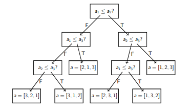

# Algoritmos de Ordenamiento
Entrada: $A\in T^{n}$ (arreglo de longitud $n$).

Salida: $A'\in T^{n}$ tal que:
    - Ordenado: $\forall\,i,j\ (0\le i<j\le n-1\Rightarrow A'[i]\le_{T} A'[j])$.
    - Permutación: $A'$ es una permutación de $A$ (mismos elementos con igual multiplicidad).

La relación $\le_{T}$ cumple:
1. Reflexividad: $\forall a\in T\;a\le_{T}a$.
2. Transitividad: $\forall a,b,c\in T\;(a\le_{T}b\wedge b\le_{T}c\Rightarrow a\le_{T}c)$.

Ejemplo: [1,3,2,1,4] -> [1,1,2,3,4]

## Motivación para ordenar
Nos sirve para buscar en O(log(n))

```console
busqbin(A[N], lo, hi, v)
    if hi < lo ⇒
        return -1; // no est
    medio = (lo + hi) / 2
    if A[medio] = v ⇒
        return medio
    else if A[medio] < v ⇒
        return busqbin(A, medio+1, hi, v)
    else
        return busqbin(A, lo, medio-1, v)
```

## Propiedades que puede tener
1. **Adaptativo:** Aprovecha el orden de la entrada
2. **Estable:** No mezcla elementos incomparables
3. **Online:** Trabaja a medida que recibe el array
4. **In-Place:** Trabaja sobre el mismo array, sin duplicarlo.

## Estilos
1. **Basados en comparación:** Sòlo podemos chequear con $\le_{T}$
2. **Especializados al tipo:** Por ej, enteros.

### Basados en comparaciòn

#### Bubble Sort
Es muy malo, recorre todo el arreglo dando vuelta 'inversiones' adyacentes. Si en una vuelta no hicimos nada: terminamos.

- Primera pasada: El màximo queda al final
- Máxima pasadas: n
- Tiempo ejecución: O($𝑁^{2}$)
- Memoria: O(𝑁)


```console
bubble(A[N])
    hiceAlgo = true
    while hiceAlgo ⇒ (
        hiceAlgo = false
        for i in 0..N-2 ⇒
            if A[i] > A[i+1] ⇒
                A[i] ↔ A[i+1]
                hiceAlgo = true
    )
```

[ **4,2**,3,1]->[2, **4,3**,1]->[2,3, **4,1**]->[ *2,3*,1,4]->[2, **3,1**,4]->[2,1, *3,4*]->[ **2,1**,3,4]->[1, *2,3*,4]->[1,2, *3,4*]->[ *1,2*,3,4]->[1, *2,3*,4]->[1,2,*3,4* ]

#### Insertion Sort
Razonable para arreglos pequeños (N $\le$ 50), vamos llevando un prefijo ordenado y agregando elementos de a uno (N-1 veces)

- Tiempo ejecución: 𝑂($𝑁^{2}$)
- Memoria: 𝑂(1)

```console
insercion(A[N])
    for i in 1..N-1 ⇒
        for j in i-1..0 ⇒
        if A[j] > A[j+1] ⇒
            A[j] ↔ A[j+1]
        else ⇒ break;
```

[ *4*,**2**,3,1]->[*2, 4*,**3**,1]->[**2**,*3*, **4**,1]->[ *2,3,4*,**1**]->[*2, 3,* **1**,*4*]->[**1**,*2,3,4* ]

Ejercicio: optimizar para evitar los swaps :

```console
insercion_opt(A[N])
    for i in 1..N-1 ⇒
        key = A[i]
        j = i-1
        while j >= 0 and A[j] > key ⇒
            A[j+1] = A[j]
            j = j-1
        A[j+1] = key
```

[**4, 2**, 3, 1]→[*2*, **4, 3**, 1]→[*2, 3*, **4, 1**]→ [*1, 2, 3, 4*]


#### Selection Sort
Razonable para arreglos pequeños (N$\le$50), pero peor que Insertion Sort. Se busca el mínimo y se pone al principio. (N-2 veces)

- Tiempo ejecución: 𝑂($𝑁^{2}$)
- Memoria: 𝑂(1)

```console
seleccion(A[N])
    for i in 0..N-2 ⇒
        minPos = i
        for j in i+1..N-1 ⇒
            if A[j] < A[minPos] ⇒ minPos = j
        A[i] ↔ A[minPos]
```

[**4**, 2, 3, 1]→[*1*, 2, 4, 3]→[*1, 2*, 4, 3]→ [*1, 2, 3*, 4]

#### MergeSort
Se combinan 2 arrays ordenados, partiendo el arreglo en N sub-arreglos de 1 elemento para poder mezclarlos y terminar ordenando todo el array combinado.

- Tiempo ejecución: 𝑂(𝑁*log(𝑁))
- Memoria: 𝑂(𝑁)

```console
mergesort(A[N])
    if N < 2 ⇒
        return A
    else ⇒
        m = N/2
        A1 = A[0..m-1]
        A2 = A[m..N-1]
        B1 = mergesort(A1)
        B2 = mergesort(A2)
        return mezclar(B1, B2)  // Devuelve un array nuevo
```

> Pregunta: Si en vez de partir al medio, partimos en N −1 y 1 ¿cómo queda el algoritmo?
El algoritmo deja de ser eficiente: pasa de 𝑂(𝑁*log(𝑁)) a 𝑂($𝑁^{2}$), termina comportándose como Insert Sort


#### QuickSort
Es el más eficiente.
Se elige un pivote $p$ (la mejor forma es usar el esquema de Hoare) y, se separa el array en: *menores a $p$* y, *mayores a $p$*. Luego, se ordenan recursivamente.

- Tiempo ejecución: Depende de $p$, peor caso: 𝑂($𝑁^{2}$)
- Memoria: 𝑂(log(𝑁))

```console
qsort(A[N])
    if N < 2 ⇒ return // no hacer nada

    p = A[N-1] // ultimo elem
    pos = particionar(A[0..N-2], p) // pos marca donde empieza la frontera
    A[N-1] ↔ A[pos]
    qsort(A[0..pos-1]) // parte izq
    qsort(A[pos+1..N-1]) // parte der


// Particion de Lomuto, Devuelve cant de elementos ≤p
particionar(A[N], p)
    j = 0
    for i in 0..N-1 ⇒
        if A[i] ≤ p
            A[i] ↔ A[j]
            j++
    return j
```

#### Otros
1. Shell sort
2. Heapsort

### Especializados al tipo 

#### Enteros
1. Counting sort
2. Radix sort

## Cota óptima
Podemos modelar cualquier algoritmo como un árbol de decisión, el algoritmo tiene que encontrar en cuál 'permutación' está.

Mejores casos equivale a caminos cortos.

Si el camino más largo es de $h$ pasos: tenemos $2^{h}$ nodos con $n!$ posibilidades distintas por lo que el peor caso es de **al menos** 𝑂(𝑁*In(𝑁)).

