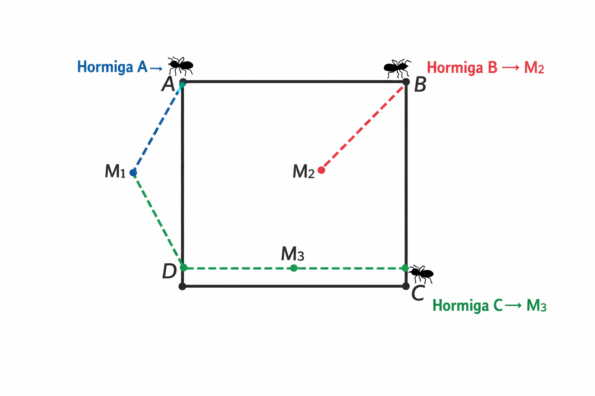

Si tres esquinas están ocupadas, la recta que une dos de ellas es un lado del cuadrado o una diagonal.

Si es un lado: la tercera hormiga se mueve paralela a ese lado.

Si es una diagonal: la tercera hormiga se mueve paralela a la diagonal 
(es decir, en dirección del otro lado del cuadrado).

Esto asegura que las trayectorias posibles siempre están alineadas con lados o diagonales del cuadrado.

---------------------

Supongamos que las hormigas están en las esquinas A, B, C de un cuadrado 𝐴𝐵𝐶𝐷.
La esquina D está vacía.

La hormiga en A puede moverse paralela a la recta 𝐵𝐶.
Esa recta es un lado, así que se mueve en dirección horizontal/vertical.

La hormiga en B se mueve paralela a la recta 𝐴𝐶.
Esa recta es diagonal, así que se mueve en dirección del otro lado.

La hormiga en C se mueve paralela a la recta 𝐴𝐵. 
Esa recta es un lado, así que también se mueve en dirección horizontal/vertical.

Con este esquema, cada hormiga puede alcanzar el punto medio de un lado distinto:

La de A llega al punto medio de 𝐴𝐷.

La de B llega al punto medio de 𝐵𝐶.

La de C llega al punto medio de 𝐶𝐷.

Por lo tanto sí pueden hacerlo.

