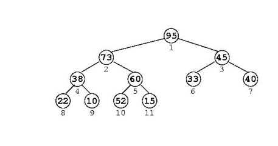

# Cola de Prioridad
Es una variente de Cola, los datos poseen una clave perteneciente a un cjto ordenado, cuyas claves se ven como prioridades

Las funciones que posee permite insertar nuevos elementos y extraer el màximo (ò mìnimo, si la estructura se organiza inversamente)

Èsta, puede ser implementada con:

- Una lista ordenada
    - Inserciòn: Para insertar tenemos que recorrer la lista, hasta encontrar el lugar que le corresponda
    - Extraer màximo: Es el primer lugar de la lista


- Una lista desordenada
    - Inserciòn: Insertamos en cualquier lugar.
    - Extraer màximo: Debemos recorrer toda la lista
  

- Array desordenado
  - Insercion: En cualquier lugar
  - Extraer màximo: Debemos recorrer todo el array
  

# Heap
Es un AB Completo, que permite su almacenamiento en un array sin usar puntero
**completo: tiene todos sus niveles llenos, excepto posiblemente el de más abajo, y en este último los nodos están lo más a la izquierda posible.*


La numeraciòn por niveles = posiciones del arreglo (de arriba a abajo, de izquierda a derecha)
El 0 lo dejamos sin usar.

Hijos del nodo $j = \{2j,\,2j + 1\}$
Padres del nodo $k = floor(k/2)$

El Heap puede usarse para implementar entonces una **Cola de Prioridad**, de modo que las claves esten ordenadas de arriba a abajo con el padre con mayor prioridad que los hijos.

## Inserciòn
Se agrega el nuevo elemento en la ultima posiciòn, para mantener la estructura del Heap. Como la restricciòn de orden no se conserva siempre, si el nuevo elemento es mayor que su padre: se intercambia y asì hasta que sea menor que algùn padre. (lo hacemos "trepar" hacìa arriba)

```c
//n:= cant elementos del Heap
//x:= elemento insertado
a[++n]=x; //agrandamos el tamaño del heap, y lo agregamos ùltimo

// j=n: arrancamos en la ultima posicion,
// j>1: mientras no lleguemos a la raìz y
// a[j]> a[j/2]: mientras nuestro elemento sea mayor que su padre
for(int j=n;j>1 && a[j]>a[j/2]; j/=2){
    // lo intercambiamos
    int temp=a[j];
    a[j]=a[j/2];
    a[j/2]=temp;
}

```

## Extraciòn del màximo
Al sacarlo de la raìz del àrbol (a[1]), debemos rellenar el lugar vacante con el ùltimo elemento del Heap y luego, reordenar segùn la prioridad intercambiandolo con el mayor de sus hijos. (se "hunde" hacia abajo)

```c
int es_mayor=1;
int max=a[1];

a[1]=a[n--]; //el ultimo va a la raiz, achicamos el heap
int j=1;

//mientras tenga algùn hijo izquierdo && no es mayor que sus hijos...
while(2*j<=n && es_mayor){ 
    int k=2*j ;  //hijo izq

    //existe el hijo derecho ? && es mayor que el derecho?
    if(k+1<=n && a[k+1]>a[k]) k=k+1; //el hijo der es el mayor

    //comparamos nuestro elemento con su hijo mayor, si es mayor: cumple la regla!
    if(a[j]>a[k]) es_mayor=0; 

    //si el hijo es mas grande, intercambiamos
    else{
        int temp=a[j];
        a[j]=a[k];
        a[k]=temp;

        j=k; 
    }
}
```