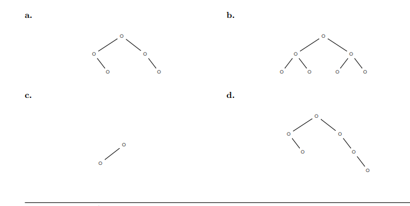

- Un arbol binario lleno es aquel que tiene todos sus niveles llenos. Es decir, cada nivel tiene todos
los nodos que puede alojar.

ˆ- Un arbol binario completo es aquel donde sus niveles tienen todos los nodos posibles, excepto quiz´as
el ultimo nivel, que se encuentra lleno de izquierda a derecha.

ˆ- Un arbol binario puede estar balanceado segun distintos criterios de balanceo, como ser altura o
cantidad de nodos, entre otros criterios posibles:

 * Un arbol binario se dice balanceado en cantidad si:
    – la cantidad de nodos en el subarbol izquierdo difiere a lo sumo en uno de la cantidad de nodos
en el subarbol derecho, y
    – el subarbol izquierdo es balanceado en cantidad, y
    – el subarbol derecho es balanceado en cantidad.

Un arbol binario se dice balanceado en altura si:
    – la altura del subarbol izquierdo difiere a lo sumo en uno de la altura del subarbol derecho, y
    – el subarbol izquierdo es balanceado en altura, y
    – el subarbol derecho es balanceado en altura.

Clasifique los arboles de las siguientes figuras en: lleno, completo, balanceado en cantidad, balanceado en
altura. Observe que algunos arboles pueden ser clasificados de mas de una forma o de ninguna.

a) balanceado en cantidad y altura

b) lleno, balanceado en cantidad y altura

c) completo, balanceado en cantidad y altura

d) ninguno.

2. Probar que todo arbol balanceado en cantidad esta balanceado en altura. Ayuda: primero demostrar
que todo arbol balanceado en cantidad de n elementos tiene altura log n.

**Paso 1: Demostrar que la altura es $O(\log n)$**

Sea $N$ la cantidad de nodos. En un nodo cualquiera:
$$N = N_{izq} + N_{der} + 1$$

Por definición de balanceado en cantidad, sabemos que:
$$|N_{izq} - N_{der}| \le 1$$

Esto significa que:
- Los nodos se reparten casi exactamente a la mitad
- El subárbol más pequeño tendrá como mínimo $\lfloor (N-1)/2 \rfloor$ nodos
- En cada paso hacia abajo, la cantidad de nodos se divide aproximadamente por 2
- Por lo tanto, la profundidad máxima (altura) es estrictamente proporcional a $\log_2(n)$

---

**Paso 2: Conectar con el Balance de Altura**

Sabemos que el número mínimo de nodos requeridos para alcanzar una altura $H$ crece de manera exponencial:
- $2^H - 1$ para un árbol lleno
- Números de Fibonacci para un AVL

Supongamos **por absurdo** que un árbol está balanceado en cantidad, pero **NO en altura**:
- Un subárbol tiene altura $H$ 
- El otro tiene altura $H-2$ (o menos)

Para que un subárbol tenga altura $H$, necesita exponencialmente más nodos que un subárbol de altura $H-2$.

Si un lado tiene exponencialmente más nodos que el otro, entonces es **matemáticamente imposible** que su diferencia de cantidad sea $\le 1$:
$$|N_{izq} - N_{der}| \le 1 \text{ ¡CONTRADICCIÓN!}$$

**Conclusión:**

La restricción de cantidad impide tener un lado muy "pesado", lo que obliga a que las alturas no puedan distanciarse más de 1 nivel. Por ende, **todo árbol balanceado en cantidad está balanceado en altura**. ✓