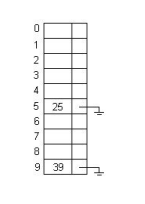
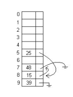

# TABLAS HASH

Queremos almacenar $n$ nros enteros, con $n ∈ [0,k-1]$

## Función de Hash: h(X)
Dado $X ∈ [0, k−1]$, retorna Y $∈ [0, m−1]$ con $m ≪ k$.
Se marca el casillero cuyo índice es $h(X)$ **(clave/key)** para indicar que $X$ pertenece al cjto de elementos dados.

$h$ distribuye los valores lo más uniformemente posible dentro de la tabla.

$P(h(X)=z) = 1/m, ∀ z ∈ [0,m−1]$

$h(X) = (c  X \bmod(p)) \bmod(m)$
con c:constante , p:nro primo y, m:tamaño tabla hash.

#### Colisiones
El problema: 2 elementos pueden tener la misma clave **(COLISION)**

Para resolver: tenemos 2 mètodos:
1. Usar estructuras dinàmicas (Encadenamiento)
2. Intentar con otra funciòn de hash (Direccionamiento abierto)

##### Encadenamiento
Todos los elementos que caen en el mismo casillera se almacenan en una estructura auxiliar.

**Para eliminar:** Eliminamos el elemento en la auxiliar.

Hay una variante, ùtil cuando la tabla no està densamente poblada

El grado de ocupaciòn se determina mediante el **factor de carga**, que es la fracciòn ocupada de la tabla.

Factor $\alpha = n/m$ , con $n$:elementos almacenados y 
$m$: tamaño de la tabla
Devuelve entre 0 y 1. 

###### Hashing con listas mezcladas
Es una variante donde en lugar de usar un àrea de rebalse, los elementos se almacenan en cualquier lugar libre del àrea primaria de la tabla. 
Para saber dònde buscar se utiliza un puntero al sig. elementos (Listas dentro de la tabla hash)

Si almacenamos el 39 con la funcion hash, ($h(X)= X \bmod(10)$) se ocupa la clave 9 en la tabla.

Luego de un tiempo:
El 15 esta almacenado en una clave que no le corresponde porque su clae (25) estaba ocupada. La primera libre que encontrò fue la clave 8.

**Para eliminar:** Debemos reenlazar las listas.

##### Direccionamiento Abierto
Consiste en una sucesión de funciones hash $\{h_0, \ldots, h_n\}$

Sup. tenemos al elemento $X$. Primero, se intenta almacenar el dato aplicando la función de hash $h_0$; si $\mathrm{tabla}[h_0(X)]$ está ocupada se prueba con $h_1$ y así sucesivamente.

Es decir, aplicando funciones hash.

Para generar esta sucesión de funciones hay diferentes formas:

###### Linear probing
Es el método más simple,las funciones de hash se definen como:

$h_0(X) = h(X)$

$h_{k+1}(X) = (h_k(X) + 1) \bmod m$, con $m$ el tamaño de la tabla.

Es decir, si el casillero esta ocupado: se prueba con el siguiente hasta encontrar uno libre.
El problema serìa cuando el factor de carga es alto, se vuelve lento.

A medida que se va llenando, empiezan a apareder clusters (casilleros consecutivos llenos) y, se empiezan a unir entre sì generando otro aùn màs grande. Este roblema se conoce como **Clustering primario**

El **Clustering secundario** ocurre cuando al realizar la bùsqueda de 2 elementos, se encuentran en el mismo casillero ocupado por lo que las bùsquedas subsiguientes seràn las mismas para ambos.

**Eliminar un elemento:**  Existen 2 maneras:
1. Se marca el casillero como 'eliminado', sin liberar el espacio (Resulta en bùsquedas màs lentas)
2. Eliminar el elemento, liberar el casillero y mover elementos de la tabla hasta que se encuentre uno verdaderamente libre. (Compleja y costosa)

###### Hashing Doble
Usa 2 funciones hash:

**Direcciòn inicial h:** $h(X) ∈ [0,m-1]$
**Paso s:** $s(X) ∈ [1,m-1]$

$h_0(X) = h(X)$

$h_{k+1}(X) = (h_k(X) + s(x)) \bmod m$, con $m$ el tamaño de la tabla.

Nota: si $s(x)=1$ ∀$X$ : tenemos *Linear probing*.

Elegir $m$ primo (relativo de $s(X)$) asegura que se visite toda la tabla, antes de que se empiecen a repetir los casilleros.

##### Otros
1. **last-come-first-served hashing:** El elemento que se mueve de casillero es el que ya lo ocupaba.
2. **Robin Hood hashing:** El elemento que se queda en el casillero es el que se encuentre màs lejos de su pos. original.